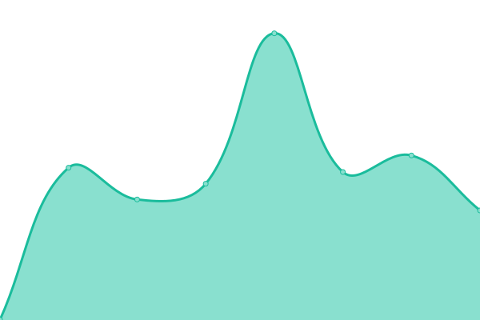
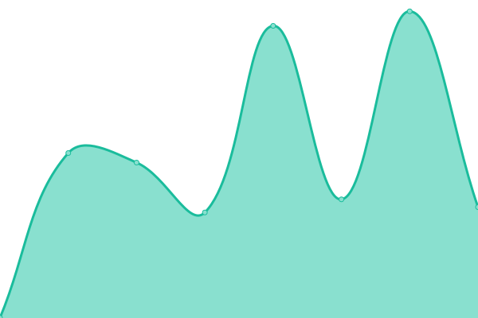

# [📈 Live Status](https://uptime.farlo.co.uk): <!--live status--> **🟩 All systems operational**

This repository contains the open-source uptime monitor and status page for [Farlo](https://farlo.co.uk), powered by [Upptime](https://github.com/upptime/upptime).

With [Upptime](https://upptime.js.org), you can get your own unlimited and free uptime monitor and status page, powered entirely by a GitHub repository. We use [Issues](https://github.com/FarloGroup/FarloSitesUptime/issues) as incident reports, [Actions](https://github.com/FarloGroup/FarloSitesUptime/actions) as uptime monitors, and [Pages](https://uptime.farlo.co.uk) for the status page.

<!--start: status pages-->
<!-- This summary is generated by Upptime (https://github.com/upptime/upptime) -->
<!-- Do not edit this manually, your changes will be overwritten -->
<!-- prettier-ignore -->
| URL | Status | History | Response Time | Uptime |
| --- | ------ | ------- | ------------- | ------ |
|  [Allegiance Musical](https://allegiancemusical.com/) | 🟩 Up | [allegiance-musical.yml](https://github.com/FarloGroup/FarloSitesUptime/commits/HEAD/history/allegiance-musical.yml) | 

 608ms
     
 | 

<a href="https://uptime.farlo.co.uk/history/allegiance-musical">100.00%</a>
    

|  [Backup Tech](https://backuptech.uk/) | 🟩 Up | [backup-tech.yml](https://github.com/FarloGroup/FarloSitesUptime/commits/HEAD/history/backup-tech.yml) | 

 2554ms
     
 | 

<a href="https://uptime.farlo.co.uk/history/backup-tech">100.00%</a>
    

|  [Cages](https://cageslondon.com/) | 🟩 Up | [cages.yml](https://github.com/FarloGroup/FarloSitesUptime/commits/HEAD/history/cages.yml) | 

 540ms
     
 | 

<a href="https://uptime.farlo.co.uk/history/cages">100.00%</a>
    

|  [Charlie and the Chocolate Factory](https://charlieandthechocolatefactory.co.uk/) | 🟩 Up | [charlie-and-the-chocolate-factory.yml](https://github.com/FarloGroup/FarloSitesUptime/commits/HEAD/history/charlie-and-the-chocolate-factory.yml) | 

 648ms
     
 | 

<a href="https://uptime.farlo.co.uk/history/charlie-and-the-chocolate-factory">100.00%</a>
    

|  [Come From Away](https://comefromawaylondon.co.uk/) | 🟩 Up | [come-from-away.yml](https://github.com/FarloGroup/FarloSitesUptime/commits/HEAD/history/come-from-away.yml) | 

 703ms
     
 | 

<a href="https://uptime.farlo.co.uk/history/come-from-away">100.00%</a>
    

|  [Cruise The Play](https://cruisetheplay.co.uk/) | 🟩 Up | [cruise-the-play.yml](https://github.com/FarloGroup/FarloSitesUptime/commits/HEAD/history/cruise-the-play.yml) | 

 945ms
     
 | 

<a href="https://uptime.farlo.co.uk/history/cruise-the-play">100.00%</a>
    

|  [Elf London](https://elflondon.com/) | 🟩 Up | [elf-london.yml](https://github.com/FarloGroup/FarloSitesUptime/commits/HEAD/history/elf-london.yml) | 

 835ms
     
 | 

<a href="https://uptime.farlo.co.uk/history/elf-london">100.00%</a>
    

|  [Farlo](https://farlo.co.uk) | 🟩 Up | [farlo.yml](https://github.com/FarloGroup/FarloSitesUptime/commits/HEAD/history/farlo.yml) | 

 523ms
     
 | 

<a href="https://uptime.farlo.co.uk/history/farlo">100.00%</a>
    

|  [Future Care Group](https://www.futurecaregroup.com/) | 🟩 Up | [future-care-group.yml](https://github.com/FarloGroup/FarloSitesUptime/commits/HEAD/history/future-care-group.yml) | 

 906ms
     
 | 

<a href="https://uptime.farlo.co.uk/history/future-care-group">100.00%</a>
    

|  [McKittrick Hotel](https://mckittrickhotel.com) | 🟩 Up | [mc-kittrick-hotel.yml](https://github.com/FarloGroup/FarloSitesUptime/commits/HEAD/history/mc-kittrick-hotel.yml) | 

 2446ms
     
 | 

<a href="https://uptime.farlo.co.uk/history/mc-kittrick-hotel">100.00%</a>
    

|  [One-Woman Show](https://one-womanshow.com/) | 🟩 Up | [one-woman-show.yml](https://github.com/FarloGroup/FarloSitesUptime/commits/HEAD/history/one-woman-show.yml) | 

 807ms
     
 | 

<a href="https://uptime.farlo.co.uk/history/one-woman-show">100.00%</a>
    

|  [Saw The Experience](https://sawtheexperience.com/) | 🟩 Up | [saw-the-experience.yml](https://github.com/FarloGroup/FarloSitesUptime/commits/HEAD/history/saw-the-experience.yml) | 

 604ms
     
 | 

<a href="https://uptime.farlo.co.uk/history/saw-the-experience">100.00%</a>
    

|  [Scenario Two](https://www.scenario-two.com/) | 🟩 Up | [scenario-two.yml](https://github.com/FarloGroup/FarloSitesUptime/commits/HEAD/history/scenario-two.yml) | 

 982ms
     
 | 

<a href="https://uptime.farlo.co.uk/history/scenario-two">100.00%</a>
    

|  [SINE Digital](https://sinedigital.co.uk/) | 🟩 Up | [sine-digital.yml](https://github.com/FarloGroup/FarloSitesUptime/commits/HEAD/history/sine-digital.yml) | 

 1297ms
     
 | 

<a href="https://uptime.farlo.co.uk/history/sine-digital">100.00%</a>
    

|  [This Is Labyrinth](http://thisislabyrinth.com/) | 🟩 Up | [this-is-labyrinth.yml](https://github.com/FarloGroup/FarloSitesUptime/commits/HEAD/history/this-is-labyrinth.yml) | 

 1259ms
     
 | 

<a href="https://uptime.farlo.co.uk/history/this-is-labyrinth">100.00%</a>
    

|  [Tom Dick and Harry](https://tomdickandharryonstage.com/) | 🟩 Up | [tom-dick-and-harry.yml](https://github.com/FarloGroup/FarloSitesUptime/commits/HEAD/history/tom-dick-and-harry.yml) | 

 642ms
     
 | 

<a href="https://uptime.farlo.co.uk/history/tom-dick-and-harry">100.00%</a>
    

|  [WondervilleUK](https://wondervilleuk.com/) | 🟩 Up | [wonderville-uk.yml](https://github.com/FarloGroup/FarloSitesUptime/commits/HEAD/history/wonderville-uk.yml) | 

 701ms
     
 | 

<a href="https://uptime.farlo.co.uk/history/wonderville-uk">100.00%</a>
    

<!--end: status pages-->

[**Visit our status website →**](https://uptime.farlo.co.uk)

## 📄 License

- Powered by: [Upptime](https://github.com/upptime/upptime)
- Code: [MIT](./LICENSE) © [Farlo](https://farlo.co.uk)
- Data in the `./history` directory: [Open Database License](https://opendatacommons.org/licenses/odbl/1-0/)
